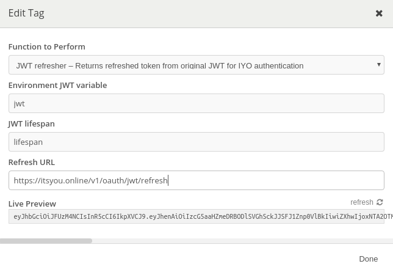

# JWT token refresh plugin for Insomnia

## Usage

Just type jwt and the plugin should pop up.


By clicking on the plugin, you can set the the environmental JWT variable and the environmental lifespan variable (number in seconds). If no lifespan variable is provided or is invalid, it will be omitted from the request.



And tada!!


## Installation

Go to the Insomia plugin directory

* Windows:  `%APPDATA%\Insomnia\plugins\`
* Linux:    `~/.config/Insomnia/plugins/` or `$XDG_CONFIG_HOME/Insomnia/plugins/`
* MacOS:    `~/Library/Application\ Support/Insomnia/plugins/`

And clone this repo in there

```bash
git clone https://github.com/chrisvdg/jwt_refresher_insomnia.git
```

Start Insomnia and the plugin should be ready for use!